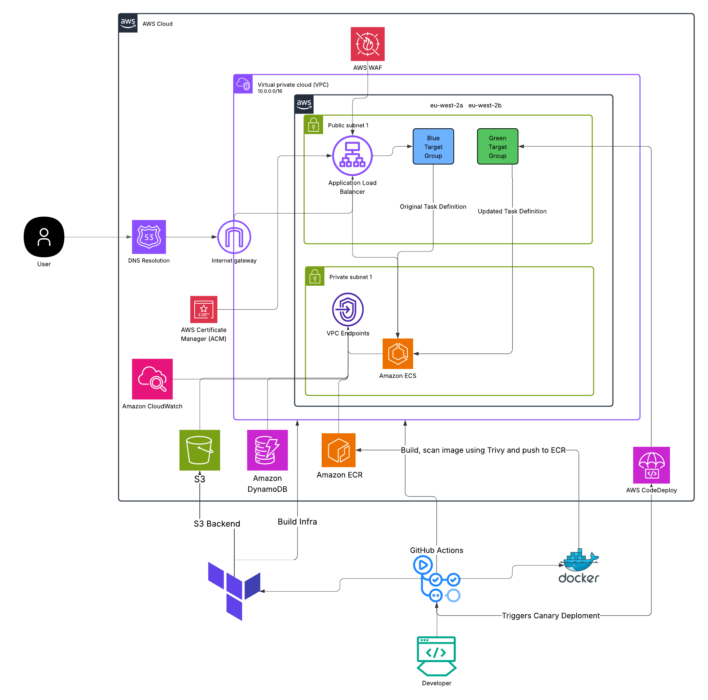
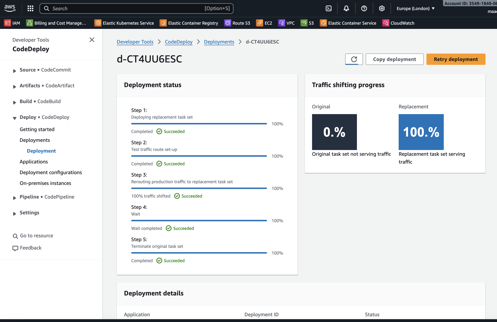
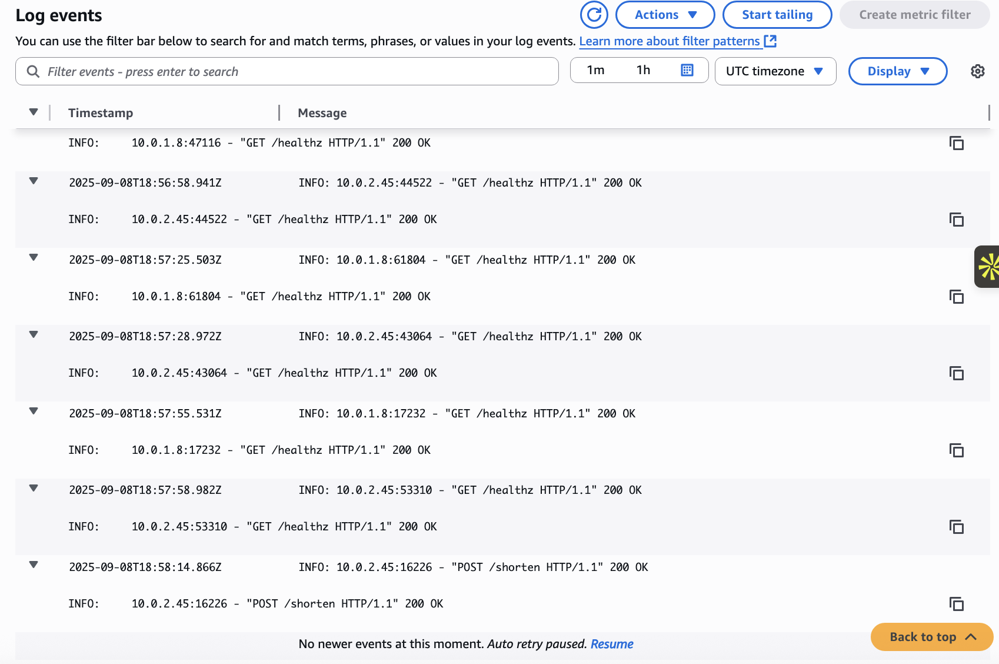
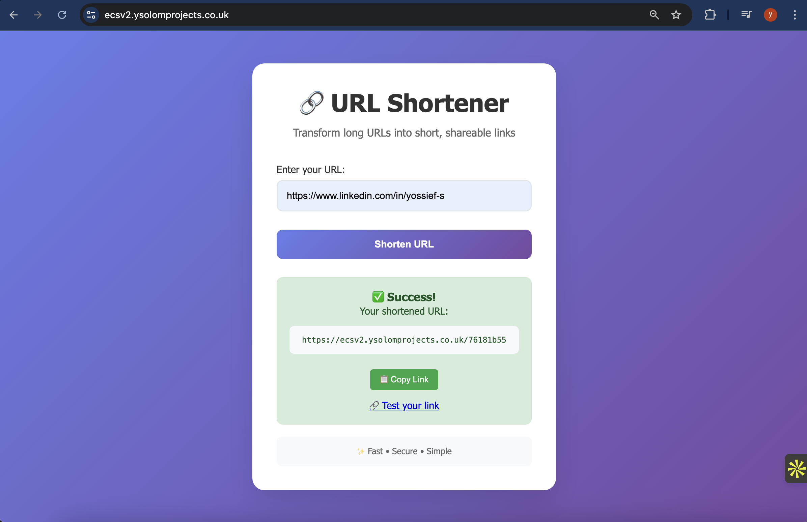

# ECS v2.0

# URL Shortener Service - ECS v2.0 Project

## Project Overview

This repository contains a production-ready URL shortener service deployed on AWS ECS Fargate focusing on production grade security best practices.

## Contents

- [Architecture](#Architecture-Diagram)
- [Infrastructure](#Infrastructure)
- [CI/CD](#CI-CD-Pipelines)
- [API Endpoints](#API-Endpoints)
- [Design Decisions and Trade-offs](#Design-Decisions-and-Trade-offs)
- [Troubeshooting](#Troubleshooting)

## Architecture Diagram

 

## Infrastructure

All infrastructure is defined as code using Terraform, with state stored in S3 with native locking. The infrastructure includes: 

- Containerised Python application running on ECS Fargate in private subnets
- Application Load Balancer with HTTP to HTTPS redirection and WAF protection
- DynamoDB for storing URL mappings (PAY_PER_REQUEST with PITR enabled)
- VPC Endpoints for secure, private connectivity (no NAT gateways)
- Canary deployment via AWS CodeDeploy triggered by GitHub Actions
- Automatic rollback on failed health checks
- GitHub Actions for CI/CD using OIDC authentication

## CI-CD Pipelines

The project uses GitHub Actions for continuous integration and deployment:

### CI Workflow

- Builds the application container
- Scans the image for vulnerabilities
- Pushes the image to ECR on successful builds to the main branch

### CD Workflow

- Runs Terraform plan and apply on pushes to /terraform 
- Triggers CodeDeploy for canary deployments
- Uses OIDC for secure AWS authentication (no long-lived keys)

## API Endpoints

- `GET /healthz` - Health check endpoint returning `{"status":"ok"}`
- `POST /shorten` - Creates a short URL from a provided long URL
- `GET /{short}` - Redirects to the original long URL

## Design Decisions and Trade-offs

- Using VPC Endpoints instead of NAT Gateways?
Using VPC Endpoints comes with a steep learning curve but cost can dramatically drop as Gateway Endpoints are free and Interface Endpoints are charged per usaged opposed a hourly rate with NAT Gateway. 

- Canary Deployment Strategy?
A canary deployment strategy is widely used in production and aligns well with minimising the blast radius from potential bugs on deployment. This focus on rolling out changes slowly means only a small amount of end users could be affected on rollout. 

- Security Considerations?
Putting ALB increasing the security of the application as we will be federating which packets are entering our app instead of just using security groups.
Following the principle of least privilege when creating IAM roles and using OIDC to prevent long lived credentials being stored. 

- Cost Optimisation Implementation?
Smaller more cost effective instance types, PITR on DynamoDB, Eliminating NAT by VPC endpoints and 

## Potential Improvements or Future Enhancements

